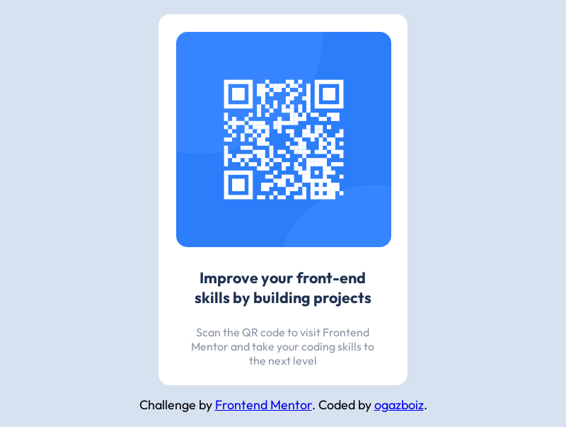

# Frontend Mentor - QR code component solution

This is a solution to the [QR code component challenge on Frontend Mentor](https://www.frontendmentor.io/challenges/qr-code-component-iux_sIO_H). Frontend Mentor challenges help you improve your coding skills by building realistic projects. 

## Table of contents

- [Overview](#overview)
  - [Screenshot](#screenshot)
  - [Links](#links)
- [My process](#my-process)
  - [Built with](#built-with)
  - [Continued development](#continued-development)
  - [Useful resources](#useful-resources)
- [Author](#author)
- [Acknowledgments](#acknowledgments)

## Overview

### Screenshot

**Desktop**

**Mobile**

### Links

- Solution URL: https://github.com/ogazboiz/qr-code-component-main
- Live Site URL: https://ogazboiz-qr-code-component.netlify.app

## My process

### Built with

- Semantic HTML5 markup
- CSS custom properties
- Mobile-first workflow

### Continued development

I'll continue to focus on areas such as better html layout, depending on the requirements that are needed and also improve the color palette and the use of selectors.

### Useful resources

- [Center a div](https://blog.hubspot.com/website/center-div-css) - This helped me for center a div horizontally and vertically

## Author

- Frontend Mentor - [@ogazboiz](https://www.frontendmentor.io/profile/omargtdev)
- Twitter - 

## Acknowledgments

This is where you can give a hat tip to anyone who helped you out on this project. Perhaps you worked in a team or got some inspiration from someone else's solution. This is the perfect place to give them some credit.
